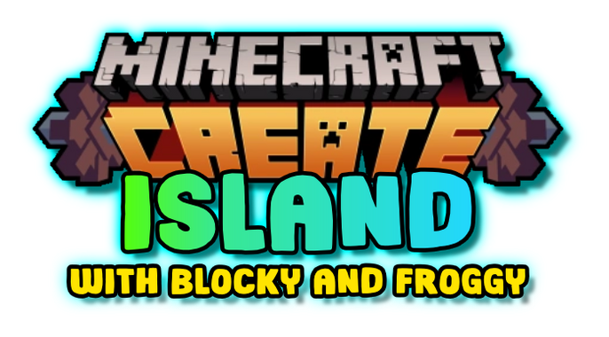

<h1 align="center">
  
</h1>

This is an unofficial release of the Create Island modpack, famously played by [Blocky](https://www.youtube.com/@BlockdownBuilds) and [Froggy](https://www.youtube.com/@frogcrafting) in their YouTube series.

Embark on an adventure where technology and creativity go hand-in-hand! This modpack is centered around the incredible **Create** mod, empowering you to design intricate contraptions and automated factories. But it's not all about gears and industry; the pack also includes a vast collection of mods for **building, decoration, and farming**, allowing you to build a cozy, picturesque island paradise. Explore a world enhanced with new structures and wildlife, all while enjoying a smooth, optimized experience.

### Features

- ⚙️ **The Age of Automation:** Dive deep into the **Create** mod and its addons. Build magnificent contraptions, set up complex processing lines, and connect your island with a fully-featured train network using **Create: Steam 'n' Rails**.
- 🏡 **Build Your Dream Island:** Unleash your inner architect with a massive selection of decorative blocks from mods like **Chipped**, **Macaw's Furniture & Fences**, **Another Furniture**, and **Decorative Blocks**. Design the ultimate base, from a cozy cottage to an industrial stronghold.
- 🍲 **A Culinary Adventure:** Go beyond basic farming with **Farmer's Delight** and its companions, **Brewin' and Chewin'** and **Chef's Delight**. Cultivate new crops, cook dozens of new meals, and set up a bustling island kitchen.
- 🗺️ **Explore a Living World:** Your island is just the beginning. Discover new **Dungeons and Taverns**, sail the seas with **Small Ships**, and find your way to new biomes with **Nature's Compass**. The world is alive with new **Wildlife** and hidden **Artifacts** to uncover.
- 🎒 **Quality of Life Galore:** Enjoy a seamless experience with essential mods like **JEI** for recipes, **Xaero's World Map** for navigation, and **Tom's Simple Storage** for organizing your ever-growing collection of resources.
- ✨ **Beautifully Optimized:** The pack includes **Sodium, Iris,** and other performance mods to ensure a smooth framerate, even with large factories. Install your favorite shaders and watch your island come to life!

### 🏝️ Play Along with the Series

Want to replicate the exact experience from the YouTube series? You're in luck!

> [!WARNING]
> This modpack is not officially published by Blocky or Froggy. The mod list has been sourced from their official website: [createmodisland.carrd.co](https://createmodisland.carrd.co/)

🌱 **World Seed**

Use this seed to start on the same island: `-1814576922`

🖥️ **Watch the Series**

_Click the image above to watch the Create Mod Island series!_
